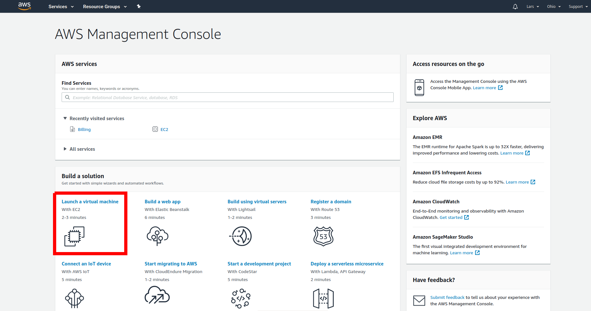
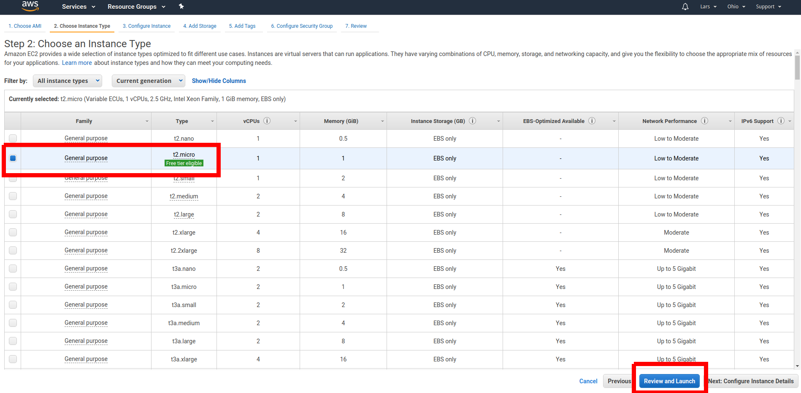

# Getting access to Linux at AWS

If you do not have access to a computer running Linux, you can use Amazon Web Services (AWS) to create a cloud-based virtual machine running Linux for free.
To do so, please follow the steps below:

1. Go to [Amazon Web Services (AWS)](https://aws.amazon.com/) and create a (free) account if you do not have one already.

2. Go to the _AWS Management Console_.

3. If you already have a running instance, go to step 8.

4. Go to _Launch a virtual machine (With EC2)_.

  

5. As Amazon Machine Image, choose _Amazon Linux 2 (HVM), SSD Volume Type_, 64-bit (x86).

  

6. As Instance Type, choose _t2.micro_, then click _Review and Launch_ and finally _Launch_ on the next screen.

  

7. Create a key pair (or use an existing one).

  

8. _Connect_ to your instance.

  

9. You can use the _EC2 Instance Connect_ connection method.

  

10. Type ``echo hello`` (and Enter) to try whether the connection works. This should print "hello" to the console.

  

Congratulations! You have now access to a machine running Linux.
