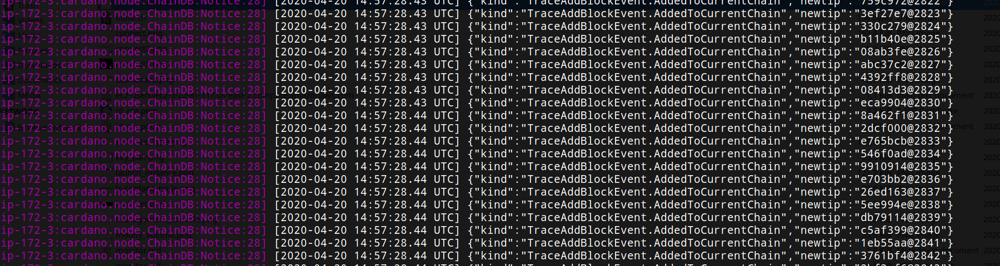

# Installing and Running a Node

1. We need the following packages and tools on our Linux system to download the source code and build it:
    - the version control system ``git``,
    - the ``gcc`` C-compiler,
    - developer libraries for the the arbitrary precision library ``gmp``,
    - developer libraries for the compression library ``zlib``,
    - developer libraries for ``systemd``
    - developer libraries for ``ncurses``,
    - the Haskell build-tool ``stack``.

   If we are using an AWS instance running Amazon Linux AMI 2 (see the [AWS walk-through](AWS.md) for how to get such an instance up and running), 
   we can install these dependencies as follows:

        sudo yum update -y
        sudo yum install git gcc gmp-devel -y
        sudo yum install zlib-devel systemd-devel ncurses-devel -y
        curl -sSL https://get.haskellstack.org/ | sh

   If you are using a different flavor of Linux, you will need to use the package manager suitable for your platform instead of ``yum``,
   and the names of the packages you need to install might differ.

2. To download the source code, we use git:

        git clone https://github.com/input-output-hk/cardano-node.git

   This should create a folder ``cardano-node``, then download the latest source code from git into it.
   After the download has finished, we can check its content by

        ls cardano-node

   
   Note that the content of your ``cardano-node``-folder can slightly differ from this!

3. We change our working directory to the downloaded source code folder:

        cd cardano-node

4. For reproducible builds, we should check out a specific release. At the time of writing, the latest release has `tag 1.9.3`, and we can check it out as follows:

        git fetch --all --tags
        git checkout tags/1.9.3

5. Now we build the node with ``stack``, which will take a couple of minutes (``stack`` first needs to download and install the GHC Haskell compiler, then compile 250+ Haskell
   packages to build the node):

        stack build

6. If you ever want to update the code to a newer version, go to the ``cardano-node`` directory, pull the latest code with ``git`` and rebuild. 
   This will be much faster than the initial build:

        cd cardano-node
        git fetch --all --tags
        git tag
        git checkout tags/<the-tag-you-want>
        stack build

7. We can start a node on the Cardano mainnet with

        scripts/mainnet.sh

   

Congratulations! You have installed the node, started it and connected it to the Cardano mainnet.
